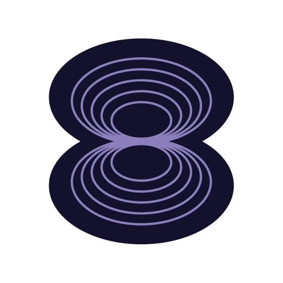

    <h1>Hi, I'm Martin </h2>
<b>Open Source | Software Development | Molecular Biology</b>

### 🧬 About Me

I am a Molecular Biology graduate student at the Westphalian University of Applied Sciences (with Life Science Informatics specialization) with a strong passion for developing computational tools to address scientific challenges.
My primary focus is to create and apply powerful new software that combines interesting science, intuitive visualization, and robust computing to solve important practical problems in molecular biology and drug discovery. I am one of the two lead developers of **PySSA**, a tool for protein structure prediction and similarity analysis. While my primary focus is building intuitive end-user software, I’m deeply interested in the intersection of biology and tech—specifically molecular visualization. On the infrastructure side, I specialize in Gradle build systems, backed by a foundational understanding of Bazel and CMake.

📧 Email: martin.urban@studmail.w-hs.de

---

### 🚦 Project Status Legend

My open-source projects display a status badge indicating their current maintenance and feature roadmap:

| Badge | Description |
| :--- | :--- |
|  | Archived or unmaintained; provided as-is for reference. |
|  | Stable with ongoing bug fixes, security updates, and maintenance. |
|  | Actively receiving new features, updates, and maintenance. |
|  | At the time of defining the state: Feature-complete and stable, no further updates. |

All states are subject to change, espcially a *Complete* can turn into *Active Feature Development* if there is a feature issue that is worth investing in. Also a *No Maintenance* can turn into other states, if they are worth reactivating.

---

### 🚦 AI Use Legend
My open-source projects include status badges that indicate the use of AI:

| Badge | Description |
| :--- | :--- |
|  | AI writes most of the code in an automated way, with only minior human intervention. |
|  | AI agents are used an guided by a human with 100% of human review, but most of the code is written by the AI. |
|  | AI assisted in different forms, but with 100% human review, but only a small portion is written by AI. |
|  | 100% AI free. |

---

### 🌟 Flagship Project: PySSA

**PySSA** is a user-friendly Graphical User Interface (GUI) for Windows that brings together the power of ColabFold's structure prediction with PyMOL's visualisation capabilities. It allows scientists to create and manage complete project workflows—from sequence to 3D structure prediction, alignment, and visual analysis—all within a single, intuitive interface. Designed for researchers and students in fields like molecular biology, it makes complex computational tasks accessible on a local computer without the need for specialised hardware or coding expertise.

  
  
  
  
  
  

---

### 📌 Other projects

| Project | Description | Status & Links |
| :--- | :--- | :--- |
| **pymake** | A zero-dependency, Python-based task runner. |   |
| **pymol-open-source-whl** | Offers unofficial binary wheels for the open-source version of PyMOL(TM). |    |
| **HEATHER** | A native, zero-dependency command-line tool for executing Pascal scripts. |    |
| **fptunes** | A blazingly fast, cross-platform CLI audio manager written in Free Pascal. |    |
| **rdkit-conan-package** | A Conan package for the RDKit library, allowing easy integration of RDKit into C++. |   |
| **ntn-ingest** | A local, single-binary Go application that imports a manually downloaded Notion Markdown-and-CSV ZIP export into a protected local mirror. |    |

---

### ⚡️ Contributions

| Project | Description | Status & Links |
| :--- | :--- | :--- |
| **pymol-open-source-setup** | Offers unofficial setups/packages for the open-source version of PyMOL(TM). |  |
| **MORTAR** | A free and open-source graphical desktop application that supports molecular in silico fragmentation and substructure analysis. |  |

---

### 📝 Templates

| Project | Description | Status & Links |
| :--- | :--- | :--- |
| **python-c-extension-template** | Template repository for building Python C Extensions with C++23 and nanobind. |   |
| **rdkit-kotlin-example-template** | Minimal working example for using RDKit in Kotlin. |   |
| **rdkit-java-example-template** | Minimal working example for using RDKit in Java. |   |
| **kotlin-bazel-example** | A template repository demonstrating a Kotlin project setup with Bazel. |   |

---

### ⭐ Certificates

  <a href="https://badges.parchment.com/public/assertions/kfzrvZImQDeODIe_o7_H6A?identity__email=martin.urban@studmail.w-hs.de" target="_blank">
    
  Visualizing Science with PyMOL 3
  </a>

  <a href="https://courses.schrodinger.com/certificates/ngmvvpdtln" target="_blank">
    
  Introduction to Molecular Modeling in Drug Discovery
  </a>

---

### 🧰 Toolbox

- **Programming Languages**: Experienced in Python. Familiar with Kotlin, Java, SQL. Basic knowledge in C, OpenGL, Pascal. 
- **Applications**: 
  - *Graphics and Modeling*: PyMOL, Mathematica, Maestro.
  - *Build automation*: Gradle, CMake, Bazel.
  - *Databases*: Sqlite, Microsoft Access.
  - *Deployment*: Inno Setup 6, Podman, Conan, GitHub Actions CI/CD.
  - *Desktop*: Microsoft Word, Microsoft Excel, Microsoft PowerPoint, Inkscape, DaVinci Resolve, Zoom. 
- **Operating Systems**: Adept in Windows (including WSL2), Linux (mainly RHEL-based distros) and very limited knowledge of macOS. 
- **IDEs**: IntelliJ (Java/Kotlin), PyCharm (Python), CLion (C/C++).
- **AI Tools**: JetBrains Junie, Gemini CLI, Google Antigravity 2.0, Google Antigravity CLI, OpenCode
